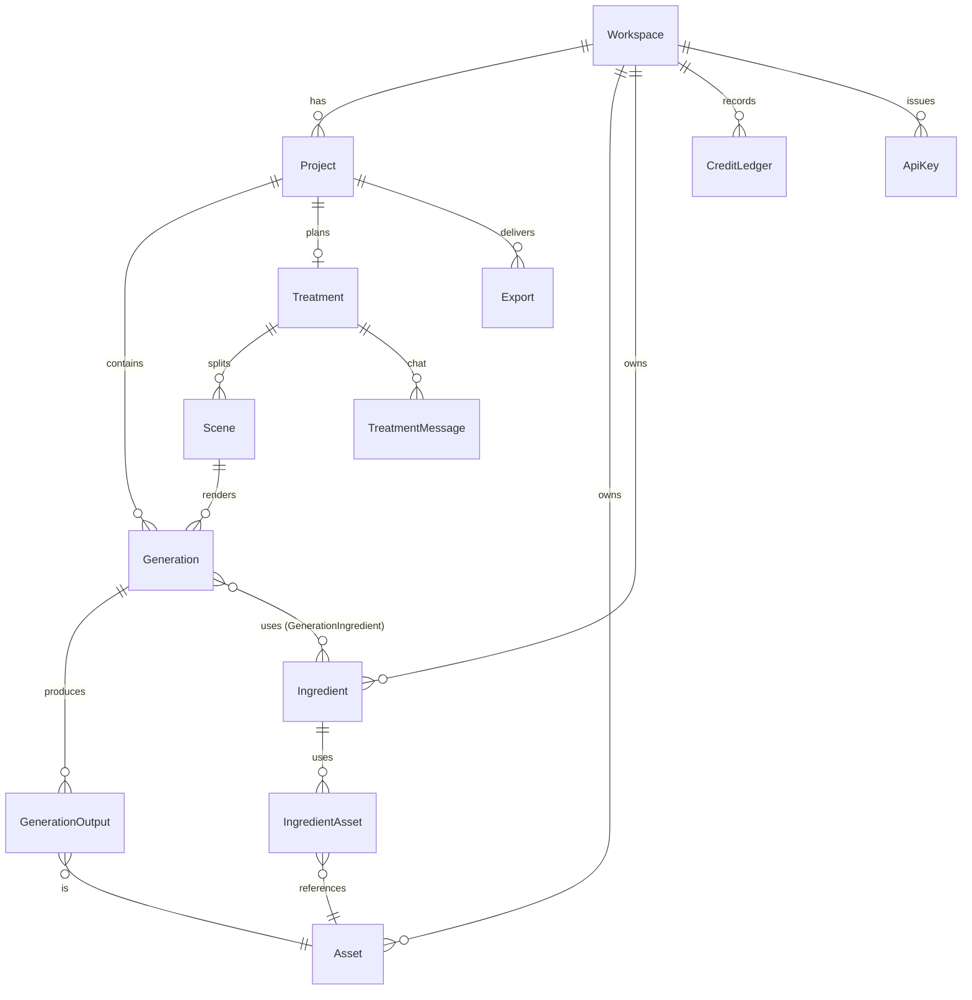

# Eclipse backend design

Status: proposal, nothing here is built yet. Written against the app as it stands (Next.js 14 App Router, Clerk v5, Prisma + Postgres, Higgsfield) and the screens the frontend already has: Dashboard, Create, Gallery, Assets, Ingredients, Agents, Library, Treatment, Settings (Billing / Team / API-MCP), Portfolio, Tutorial.

## 1. What exists today, and what is wrong with it

| Today | Problem |
| --- | --- |
| `POST /api/generate` calls Higgsfield and polls inside the request (55 s budget) | Video takes minutes, so this cannot work for video and is fragile for images. A closed tab loses the result. |
| `Generation { userId, prompt, imageUrl }` | No project, status, model, cost or failure reason. `imageUrl` is the provider's temporary URL, so old renders will break. |
| No credits | The UI shows "0 credits" but nothing meters or charges. Nothing stops unlimited spend on the Higgsfield key. |
| Everything keyed by `userId` | Team plan (seats) and shared projects cannot be added later without rewriting every query. |
| `Project` has only a name | Nothing hangs off a project: no renders, assets, treatment or exports. |
| Higgsfield request/response shape is a guess | Biggest technical risk. Isolated in one file, which is good. |
| `prisma db push` | Fine for a prototype, not for data you cannot lose. |

Keep: Clerk for identity, Postgres + Prisma, the `clerkEnabled` demo mode (client-only, untouched), soft-delete Bin on projects.

## 2. Principles

1. **Everything is scoped to a workspace**, not a user. A user always has a personal workspace; a team is a workspace with several members. Credits, projects, assets and keys belong to the workspace.
2. **Generation is asynchronous.** A request creates a job and returns immediately; completion arrives by provider webhook, with a sweeper as the safety net. The browser polls our API, never the provider.
3. **We own the files.** Provider output is copied into our own storage the moment it finishes. Provider URLs are never shown to users.
4. **Credits are a ledger.** Balance changes only by appending a ledger row in the same transaction that changes the balance. Every charge is reversible and traceable to a generation or a payment.
5. **Providers sit behind one interface.** Higgsfield today; swapping or adding a model never touches routes or UI.
6. **Every external callback is idempotent** (Stripe, Clerk, Higgsfield, retried client requests).

## 3. Architecture

```
Browser ──► Next.js route handlers (Vercel) ──► Postgres (Neon, pooled)
   │                │   │   │
   │                │   │   └─► Object storage (Cloudflare R2): uploads + finished renders
   │                │   └─────► Higgsfield (submit job, receive webhook)
   │                └─────────► Anthropic API (Treatment chat)
   └── presigned PUT ─────────► R2 (uploads go straight to storage, not through our functions)

Stripe ──webhook──► /api/webhooks/stripe        Clerk ──webhook──► /api/webhooks/clerk
Higgsfield ─webhook─► /api/webhooks/higgsfield  Vercel Cron ─► /api/cron/sweep, /api/cron/purge
```

No separate queue or worker server at first. The `generations` table is the queue; webhooks drive it forward and a one-minute cron repairs anything stuck. Add Inngest (or similar) only when the video pipeline needs multi-step retries (section 8).

Choices and why:

- **Neon Postgres** with a pooled connection string for the app and a direct one for migrations (`url` + `directUrl` in the Prisma datasource). Prisma on serverless needs the pooler.
- **Cloudflare R2** for files: no egress fees, which matters once video is served. S3-compatible, presigned uploads, custom CDN domain. Vercel Blob is the simpler alternative if egress stays small.
- **Stripe** for subscriptions and top-ups. Credits are granted by webhook, never by the browser.
- **zod** for every request body and for model parameter schemas.
- **Clerk Organizations** for team membership and invites, so we do not build an invite system. Roles come from Clerk's `orgRole`.

## 4. Data model

Names are Prisma-style; snake_case table mapping as today. All ids `cuid()`. Every table below except `onboarding`, `portfolio` and `stripe_events` carries `workspaceId` and is only ever queried with it.



### Identity and tenancy

- **Workspace**: `id`, `kind` (PERSONAL | TEAM), `clerkUserId?` (personal) or `clerkOrgId?` (team), `name`, `plan` (TRIAL | STARTER | GROWTH | SCALE), `creditBalance Int` (cached; the ledger is the truth), `stripeCustomerId?`, `stripeSubscriptionId?`, `planRenewsAt?`. A personal workspace is created lazily on a user's first API call (upsert on `clerkUserId`), so there is no ordering dependency on webhooks.
- **Onboarding** (exists): keep as is, keyed by `userId`.
- **Portfolio**: `userId` unique, `slug` unique, `draft Json`, `published Json?`, `publishedAt?`. Backs the avatar-menu Portfolio builder; Publish and Copy link switch on once `/p/[slug]` exists.
- Team membership is read from Clerk (`auth().orgId`, `orgRole`). No members table. Roles: admin can manage billing, keys and members; member can create and read.

### Content

- **Project**: add `workspaceId`, `createdById`. Keep `deletedAt` (Bin). A cron purges rows in the Bin for more than 30 days, and the files of their generations with them.
- **Asset**: one row per file in storage. `kind` (IMAGE | VIDEO | AUDIO | DOCUMENT), `storageKey`, `mimeType`, `bytes`, `width?`, `height?`, `durationMs?`, `sha256`, `source` (UPLOAD | GENERATED | IMPORT), `projectId?`, `libraryAt?` (set when saved to the Library), `deletedAt?`.
- **Ingredient**: a reusable character, product or scene. `role` (CHARACTER | PRODUCT | SCENE), `name`, `notes`, `coverAssetId?`. Always workspace-level so it can be reused across projects. **IngredientAsset** joins it to its reference images.
- **Library** is not a table: it is a query over `Asset where libraryAt not null` plus `Ingredient`, filtered by the same five tabs the UI has (All, Ingredients with role chips, Images, Videos, Audio). **Gallery** is `Generation where projectId = :id`.

### Generation (replaces today's table)

```prisma
model Generation {
  id               String   @id @default(cuid())
  workspaceId      String
  projectId        String
  createdById      String
  sceneId          String?            // set when rendered from a Treatment scene
  kind             GenKind            // IMAGE | VIDEO | AUDIO
  status           GenStatus @default(QUEUED) // QUEUED | SUBMITTED | RUNNING | SUCCEEDED | FAILED | CANCELED
  model            String             // our model id, see lib/models.ts
  provider         String             // "higgsfield"
  params           Json               // validated against the model's zod schema: prompt, aspectRatio, duration...
  providerJobId    String?  @unique
  idempotencyKey   String?
  creditsCharged   Int                // debited at creation, refunded on failure
  errorCode        String?            // MODERATION | PROVIDER | TIMEOUT | INSUFFICIENT_CREDITS | ...
  errorMessage     String?
  submittedAt      DateTime?
  finishedAt       DateTime?
  createdAt        DateTime @default(now())
  @@unique([workspaceId, idempotencyKey])
  @@index([workspaceId, projectId, createdAt(sort: Desc)])
  @@index([status, createdAt])        // sweeper
}
```

Related: **GenerationOutput** (`generationId`, `assetId`, `index`) because one job can return several images; **GenerationIngredient** (`generationId`, `ingredientId`) records which references were used, which is what makes character/product consistency repeatable.

### Credits and billing

- **CreditLedger**: `workspaceId`, `delta Int`, `balanceAfter Int`, `reason` (GRANT | PURCHASE | CHARGE | REFUND | ADJUST | EXPIRE), `generationId?`, `stripeEventId?`, `idempotencyKey` unique, `createdAt`. Append-only.
- **StripeEvent**: `id` (Stripe's event id, primary key), `processedAt`. Inserting first and skipping on conflict makes webhook handling idempotent.
- Plans stay in `src/lib/plans.ts` (still placeholder); each gains a `stripePriceId`. A `lib/pricing.ts` maps `(model, params)` to a credit cost with our margin over the provider's cost.

### Treatment (the Video step 1 page)

- **Treatment**: `projectId` unique, `mode` (BRIEF | CONCEPT | GUIDE), `brief Text?`, `concept Json?` (`{ logline, goal, audience, tone, scenes[] }`), `updatedAt`.
- **TreatmentMessage**: `treatmentId`, `role` (USER | ASSISTANT), `content`, `attachments Json?` (asset ids).
- **Scene**: `treatmentId`, `position`, `title`, `description`, `prompt`, `durationSec`, `chosenOutputId?`. These are the Video step 2 (Prompts) rows; step 3 (Generate) is `Generation` rows pointing at a scene; step 4 is **Export** (`projectId`, `status`, `settings Json`, `assetId?`).

### Developer access

- **ApiKey**: `workspaceId`, `createdById`, `name`, `prefix` (first 8 chars, shown in the UI), `hash` (SHA-256 of the key), `scopes`, `lastUsedAt?`, `revokedAt?`. The full key is shown once at creation and never stored.

## 5. The generation pipeline (the core of the product)

```
POST /api/generations  { projectId, kind, model, params, ingredientIds?, idempotencyKey }
 1. requireContext()            -> { userId, workspaceId, role }
 2. validate params with the model's zod schema; check project belongs to workspace
 3. cost = price(model, params)
 4. TX: debit credits (atomic), insert ledger CHARGE, insert Generation(QUEUED)
        UPDATE workspaces SET credit_balance = credit_balance - :cost
        WHERE id = :ws AND credit_balance >= :cost       -- 0 rows => 402 INSUFFICIENT_CREDITS
 5. after commit: provider.submit() with our webhook URL -> save providerJobId, status SUBMITTED
        submit fails  -> TX: status FAILED + ledger REFUND, return 502
 6. return 202 { id, status }

Higgsfield ──► POST /api/webhooks/higgsfield  (verified)   or   sweeper finds it
 7. finalize(id), idempotent via compare-and-set on status:
        SUCCEEDED: stream each output provider -> R2, create Asset + GenerationOutput rows, set SUCCEEDED
        FAILED / moderated: set FAILED + errorCode, ledger REFUND

GET /api/generations/:id   -> status + output asset URLs (client polls: 2 s, backing off to 10 s)
```

Details that matter:

- **Crash safety.** If the function dies between step 4 and 5, the row stays `QUEUED`. The sweeper (every minute) submits any `QUEUED` older than 30 s, and re-checks any `SUBMITTED/RUNNING` older than its expected time by asking the provider directly. If the provider's webhook is unreliable, the sweeper plus a lazy refresh inside `GET /api/generations/:id` covers it.
- **Idempotency.** The client sends a UUID per click. The unique `(workspaceId, idempotencyKey)` index turns a double-click or retry into the same job, not a second charge.
- **Concurrency limit** per workspace (for example 3 running jobs, more on higher plans) checked by a count query before step 4. Prevents one account draining the provider quota.
- **Cancel**: `POST /api/generations/:id/cancel` asks the provider to cancel if it can, then refunds if the job had not completed.
- **Moderation.** Provider "nsfw/failed" maps to `errorCode: MODERATION` with a friendly message; refunded.
- **Provider interface** (`src/lib/providers/types.ts`):
  ```ts
  interface Provider {
    submit(model: ModelDef, params: unknown, webhookUrl: string): Promise<{ providerJobId: string }>;
    status(providerJobId: string): Promise<{ state: "running" | "succeeded" | "failed" | "moderated"; outputUrls?: string[]; error?: string }>;
    cancel?(providerJobId: string): Promise<void>;
    parseWebhook(req: Request): Promise<{ providerJobId: string } | null>; // also verifies authenticity
  }
  ```
  `lib/models.ts` is the registry of what users can pick: `{ id, kind, provider, providerModel, paramsSchema, price(params) }`. The Create page's aspect-ratio list and the future video options come from here.

## 6. Files and storage

- **Upload**: `POST /api/assets/upload-url` (checks type, size cap, workspace quota) returns a presigned PUT; the browser uploads to R2 directly; `POST /api/assets` confirms, reads metadata (dimensions, duration) and creates the row. Brief documents (PDF, DOCX, TXT, MD) go through the same path with `kind: DOCUMENT`.
- **Serving**: public CDN URL for renders and library items shown in the app via short-lived signed URLs, so a leaked link stops working. Keys are `workspaceId/assetId/...`, never guessable names.
- **Link import** (the link icon in the Treatment box): server fetches the URL with SSRF protection (block private IP ranges, redirects capped, size and time limits), then stores it as an Asset.
- **Quotas**: bytes per workspace by plan; enforced at `upload-url`.
- **Deletion**: soft delete first (`deletedAt`), the purge cron removes the file and row. Deleting a project cascades to its generations and assets that are not in the Library.

## 7. Treatment AI

- `POST /api/treatments/:id/messages` streams the assistant reply (server-sent events) from the Anthropic API, with the system prompt chosen by the mode: **Brief** (extract goals, audience, requirements from the uploaded or pasted brief and propose concepts), **Concept** (develop an idea with the user), **Guide** (ask one question at a time: product, audience, tone, platform).
- The model returns structured output for the `concept` JSON through a tool call, so the UI can show "No concept yet" → a real concept, and "Continue to prompts" enables when `concept.scenes` is non-empty.
- Document text is extracted server-side (PDF/DOCX/TXT) and sent as context; images attached through Character / Product / Location / Style become `GenerationIngredient`s later.
- Model id comes from an env var (`ANTHROPIC_MODEL`), prompt caching on the system prompt, a per-workspace daily message cap. **Open decision**: free within the cap, or a small credit cost per message (section 11).

### 7a. Agents

The Agents page (Agent 1, 2, 3) maps to three configurations of the same chat engine used by Treatment. An `Agent` is code config in `lib/agents.ts`, not a table: `{ id, name, systemPrompt, tools[], model, inputs }`. Conversations are stored per project in `AgentThread` (`projectId`, `agentId`, `createdById`) and `AgentMessage` (`role`, `content`, `attachments`, `toolCalls Json?`), the same shape as `TreatmentMessage`, so Treatment can become "Agent 1 on the Treatment page" without a second chat system. The user's selected agent stays in browser storage today; move it to the user profile once the Agents page is real.

- **Agent 1, brainstorming partner.** Long-context chat over the project's treatment and saved ingredients; its prompt tells it to push back and ask hard questions rather than agree. Tools: read treatment, read ingredients, update the concept JSON.
- **Agent 2, creative partner.** Tools: `write_prompt` (structured JSON prompts), `break_down_image` (JSON breakdown of a reference image), `seedance_prompt`, `storyboard` (scenes into `Scene` rows), and `generate` (calls the normal generations pipeline, so each use is metered and shows in Gallery). Prompt style guides live as versioned files in the repo so they can be improved without a deploy of logic.
- **Agent 3, screening agent.** Takes generation outputs (images, video frames, audio transcript), returns a structured verdict `{ score, issues[], remakeRecommended, remakeNotes, audienceReception }`, stored on the generation (`Review` table: `generationId`, `agentId`, `verdict Json`). The UI can show a badge per render and a "remake" action that pre-fills a new generation.
- Agent usage costs credits (or a daily cap, see decision 4); `generate` calls inside Agent 2 charge normally through the ledger.

## 8. Video and Export

- Video generation uses the same pipeline with `kind: VIDEO` and longer expected times; webhooks and the sweeper already cover it. Per-scene generations are linked by `sceneId`; the user picks one output per scene (`chosenOutputId`).
- **Export** stitches the chosen clips, optionally adds the Music and Voiceover tracks, and produces one MP4. Serverless functions cannot run ffmpeg reliably, so pick one:
  1. **Hosted renderer** (Shotstack, Creatomate): fastest to ship, per-minute fee.
  2. **Our own worker** (a small container on Fly/Railway running ffmpeg, fed by a queue): cheaper at scale, more to operate.
  Start with option 1 behind an `ExportRenderer` interface so option 2 can replace it. Multi-step jobs (render scenes, then export) are where adding Inngest pays for itself.
- Audio (Voiceover, Music, Sound effects) is another `kind: AUDIO` set of models through the same registry.

## 9. API surface

Internal routes (session auth via Clerk; everything workspace-scoped). Errors are always `{ error: { code, message } }` with correct HTTP status; unknown ids are 404, never 403, so ids cannot be probed.

| Area | Routes |
| --- | --- |
| Context | `GET /api/me` (profile, workspace, plan, credits, role) |
| Projects | `GET/POST /api/projects`, `GET/PATCH/DELETE /api/projects/:id` (existing; add workspace scoping) |
| Generations | `POST /api/generations`, `POST /api/generations/quote`, `GET /api/generations?projectId=&cursor=`, `GET /:id`, `POST /:id/cancel`, `DELETE /:id` |
| Assets | `POST /api/assets/upload-url`, `POST /api/assets`, `GET /api/assets`, `PATCH /:id` (rename, save to Library), `DELETE /:id` |
| Ingredients | `GET/POST /api/ingredients`, `PATCH/DELETE /:id`, `POST /:id/assets` |
| Library | `GET /api/library?kind=&role=&q=&cursor=` |
| Agents | `GET /api/agents`, `POST /api/agent-threads/:id/messages` (SSE), `POST /api/generations/:id/review` (Agent 3) |
| Treatment | `GET/PUT /api/projects/:id/treatment`, `POST /api/treatments/:id/messages` (SSE), `GET/PUT /api/treatments/:id/scenes` |
| Export | `POST /api/projects/:id/exports`, `GET /api/exports/:id` |
| Billing | `POST /api/billing/checkout`, `POST /api/billing/portal`, `GET /api/billing/ledger` |
| Keys | `GET/POST /api/keys`, `DELETE /api/keys/:id` |
| Portfolio | `GET/PUT /api/portfolio`, `POST /api/portfolio/publish`; public page `/p/[slug]` |
| Webhooks | `/api/webhooks/clerk`, `/api/webhooks/stripe`, `/api/webhooks/higgsfield` |
| Cron | `/api/cron/sweep` (every minute), `/api/cron/purge` (daily: Bin, orphan files) |
| Public | `POST /api/mcp` (Streamable HTTP, `Authorization: Bearer <key>`), tools `generate_image`, `get_generation`, `list_generations`, `get_credits` as the Settings panel already promises |

`/api/generate` stays for one release as a thin wrapper over the new endpoint so the current Create page keeps working during the migration.

## 10. Cross-cutting

- **Auth helper**: one `requireContext()` that returns `{ userId, workspaceId, role }` (Clerk session, or a hashed API key for `/api/mcp`). Routes never read `auth()` themselves, and no query is written without `workspaceId`. Optional defence in depth later: Postgres row-level security keyed on a per-request setting.
- **Validation**: zod on every body and query string; reject unknown fields; prompt cap stays 2000.
- **Rate limiting**: per user and per key on the expensive routes (generations, messages, upload-url). Start with a DB-backed counter; move to Upstash Redis if it shows up in load.
- **Secrets and env**: validated at boot with zod (`HIGGSFIELD_API_KEY`, `HIGGSFIELD_WEBHOOK_SECRET`, `STRIPE_*`, `R2_*`, `ANTHROPIC_API_KEY`, `DATABASE_URL`, `DIRECT_URL`, `CLERK_*`); the app refuses to start half-configured in production.
- **Webhook security**: Clerk (svix signature), Stripe (signature header), Higgsfield (shared secret or signature, whatever it supports; see risks).
- **API keys**: 32 random bytes, prefixed (`ecl_live_...`), only the SHA-256 stored, constant-time compare, per-key rate limit and revoke.
- **Observability**: Sentry for errors, structured logs with a request id and `workspaceId`/`generationId`, and a daily report of provider cost vs credits charged so margins are visible.
- **Privacy**: Clerk `user.deleted` webhook deletes the personal workspace and its files; Bin purge at 30 days; no prompts or files in logs.
- **Migrations**: switch from `prisma db push` to `prisma migrate` before the first real user.
- **Tests**: unit tests (vitest) for the ledger (no overdraft, refund once, idempotent grants), the generation state machine with a fake provider, and price calculation; Playwright e2e for create → result against the fake provider.

## 11. Build order

Each phase ships something visible and is safe to stop after.

| Phase | Backend work | Unlocks in the UI |
| --- | --- | --- |
| 0. Foundations | `prisma migrate`, workspace + `requireContext()`, backfill existing users/projects, zod, env check, error format, test setup | Nothing visible; everything after depends on it |
| 1. Real generation | Provider interface + Higgsfield adapter (verified against the live API first), R2, `Generation/Asset/Output`, ledger with a manual grant, webhook + sweeper, `/api/generations`, Gallery from the DB | Create works end to end, renders survive, Gallery per project, credits pill shows a real number |
| 2. Billing | Stripe checkout and portal, plan grants on `invoice.paid`, top-ups, ledger endpoint | Billing & credits panel, Upgrade buttons, Credit history |
| 3. Library and uploads | Upload flow, Assets, Ingredients, Library query, Ingredients picker in Create | Assets page, Library tabs, Ingredients chip on Create |
| 4. Treatment and agents | Anthropic streaming, brief extraction, `concept` JSON, scenes; Agent 1 and Agent 2 chat, Agent 3 review | Treatment chat, Brief/Concept/Guide, Continue to prompts, Agents page |
| 5. Video and audio | Video + audio models, scene generations, export renderer | Prompts, Generate, Export steps; Voiceover, Music, Sound effects |
| 6. Platform | API keys + MCP, Clerk Organizations for Team, Portfolio publish | API/MCP panel, Team & seats, Portfolio Publish and Copy link |
| Later | Avatars, Certificates, translation | Their "Soon" pages |

## 12. Risks and open decisions

**Risks**
1. **Higgsfield API shape is unverified** (endpoint, auth header, `aspect_ratio`, webhook support, video parameters, pricing). Phase 1 starts by confirming these against the real API; the design assumes asynchronous jobs with a status URL and ideally webhooks. If webhooks are not offered, the sweeper plus lazy refresh carries all completion handling and nothing else changes.
2. **Provider cost vs credit price.** Plan credit amounts in `plans.ts` are placeholders; margins cannot be set until real per-model costs are known.
3. **Video export infrastructure** is the only piece that needs something other than serverless functions.

**Decisions I need from you** (my recommendation first)
1. File storage: Cloudflare R2 (alternative: Vercel Blob).
2. Billing: Stripe subscriptions with credit top-ups.
3. Teams: Clerk Organizations, a TEAM workspace per org.
4. Does Treatment chat cost credits? Recommendation: free within a daily cap, so planning never feels metered while generation does.
5. Export renderer: hosted (Shotstack-style) first, own worker later.
6. Database host: Neon (pooled), unless you already have Postgres elsewhere.
